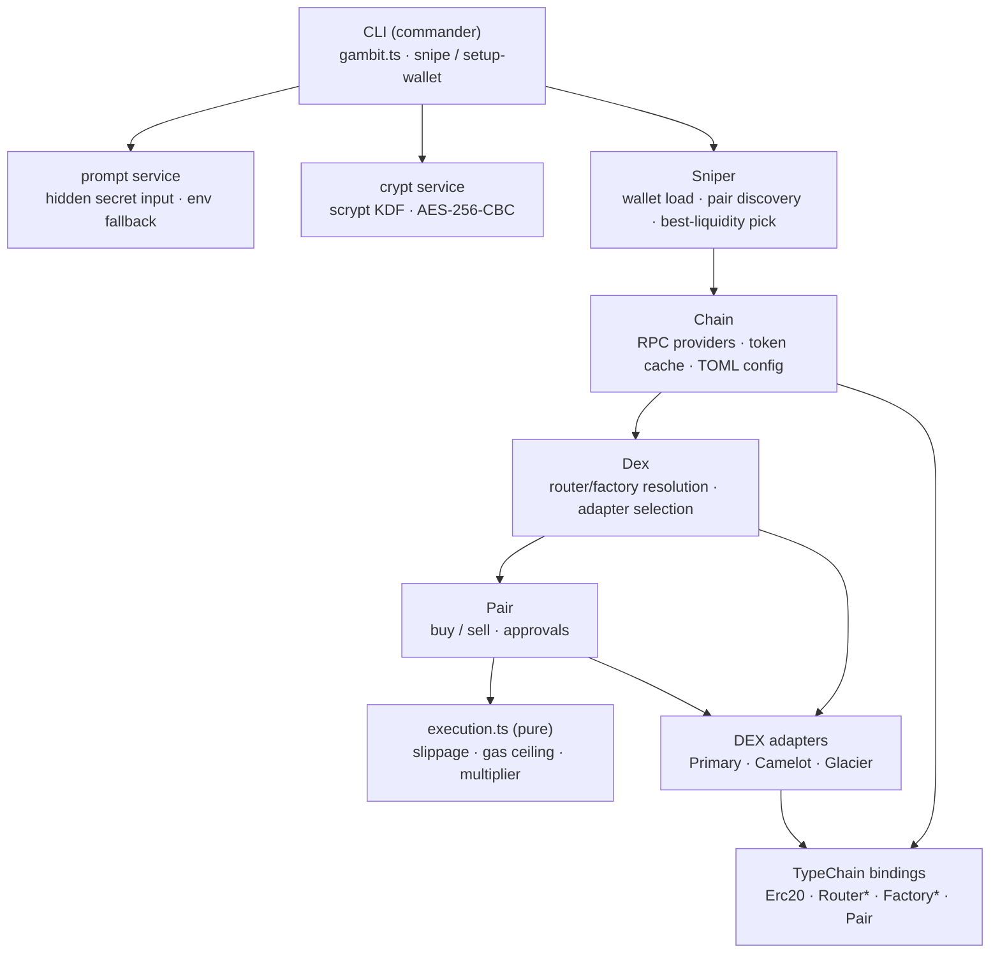

# Gambit

**A low-latency EVM execution engine for time-sensitive DEX trades, with a
pluggable multi-DEX adapter layer.**

Gambit constructs, prices, and submits swap transactions against
Uniswap-V2-style AMMs across multiple EVM chains, optimizing for the moment
liquidity appears. Under the hood it is a small study in the problems that make
on-chain execution hard: routing across DEXes whose router ABIs disagree,
choosing a gas limit under a moving block-gas ceiling, bounding slippage in
integer wei math, and keeping signing keys off disk in plaintext and off the
command line.

The original use case — sniping a liquidity pool the instant it opens — is what
forced those problems into the open. That use case is described below, but it is
the *problem domain*, not the point. The point is the execution infrastructure.

> **Portfolio note.** This repo is a sanitized version of a bot I ran a few
> years ago, brought up to date as a portfolio piece. It ships no wallets, no
> keys, and no private configuration — only public contract addresses. The
> [`CHANGELOG`](./CHANGELOG.md) records the 2026 modernization pass, and the
> [Design Observations](#design-observations-gaps--risks) section is a candid
> account of what I'd keep, what I fixed, and what I'd still change.

---

## What it demonstrates

- **Low-latency execution.** A tight pair-discovery loop, cached token metadata,
  parallelized RPC reads, and a pending-nonce fast path so a buy can fire the
  moment an operating pair with sufficient liquidity is found.
- **A multi-DEX adapter layer.** Different DEXes ship subtly different router
  ABIs. Gambit hides those differences behind a uniform adapter interface so the
  trade logic never branches on which DEX it's talking to (see below — this is
  the centerpiece).
- **Gas optimization under adversarial conditions.** Estimated gas is clamped to
  a percentage of the live block gas limit, then scaled by a safety multiplier —
  all in integer basis-point math to avoid floating-point drift on-chain.
- **Safe transaction construction.** Slippage-bounded minimum-out, explicit gas
  price / limit / nonce, and fee-on-transfer-safe swap selectors throughout.
- **Typed contract bindings.** Every contract call goes through TypeChain-
  generated types (ERC-20, factory, pair, and per-DEX router variants), so a
  wrong argument is a compile error, not a reverted transaction.
- **Encrypted key handling.** Wallet keys are stored AES-256-CBC encrypted under
  a scrypt-derived key, and secrets are prompted for rather than passed on the
  command line.

## The adapter pattern (the centerpiece)

The most valuable thing here is the abstraction that only gets written *after*
you've been burned by production DEX quirks. Every DEX in this space is "a
Uniswap V2 fork," right up until it isn't:

- **Camelot** (Arbitrum) adds a **referrer address** argument in the middle of
  its swap selectors. Same function name, different arity.
- **Glacier** (Avalanche, a Solidly/Velodrome fork) threads a **`stable` boolean
  flag** through pair lookup — `getPair(a, b, stable)` — because it maintains
  separate stable and volatile pools for the same token pair.
- Everything else — Pancake, SushiSwap, Uniswap V2, and friends — speaks the
  vanilla V2 router interface.

Rather than scatter `if (dex === 'camelot')` across the trade path, Gambit
resolves a **pair adapter** and a **factory adapter** once, and the buy/sell
logic calls a uniform interface (`buy`, `buyNative`, `sell`, `sellNative`,
`getPair`). Adding a new DEX with its own quirk is a new file in
[`src/libs/dex/`](./src/libs/dex/) plus its TypeChain-generated router — not a
change to the execution core.

```ts
// src/libs/pair.ts — selection happens once, per trade
const pairAdapters = { camelot: Camelot };

export const getPairAdapter = (dexName: string, pair: Pair) => {
  if (!Object.keys(pairAdapters).includes(dexName)) {
    return new Primary(pair); // vanilla V2 default
  }

  const Adapter = pairAdapters[dexName as keyof typeof pairAdapters];

  return new Adapter(pair);
};
```

## Architecture

Layered, with each layer depending only on the one below it. Selection of the
chain, DEX, and adapter is data-driven from per-chain TOML config.



| Layer | Responsibility |
| --- | --- |
| **CLI** ([`gambit.ts`](./src/gambit.ts)) | Argument parsing; resolves secrets via prompt/env before doing anything. |
| **Sniper** ([`libs/sniper.ts`](./src/libs/sniper.ts)) | Loads the wallet, discovers the operating pair, and picks the most-liquid source token. |
| **Chain** ([`libs/chain.ts`](./src/libs/chain.ts)) | RPC providers, wallet connection, token metadata caching, per-chain config. |
| **Dex** ([`libs/dex.ts`](./src/libs/dex.ts)) | Resolves router + factory contracts and selects the right adapters. |
| **Pair** ([`libs/pair.ts`](./src/libs/pair.ts)) | Prices, builds, and submits buys/sells; manages approvals. |
| **execution.ts** ([`libs/execution.ts`](./src/libs/execution.ts)) | Pure slippage + gas math. Fully unit-tested. |
| **Adapters** ([`libs/dex/`](./src/libs/dex/)) | Per-DEX router/factory quirk handling behind a uniform interface. |
| **TypeChain** ([`typechain/`](./src/typechain/)) | Generated, typed contract bindings. |

## Install

Requires Node 20+.

```bash
npm install
npm run build
npm test
```

## Usage

Run `./gambit.js` to see available commands. Secrets are never taken as CLI
arguments — they're prompted for (hidden) or read from the environment.

### `setup-wallet`

Encrypts a wallet address + private key into `wallets/<name>.crypt` (scrypt +
AES-256-CBC). The private key and password are prompted for:

```bash
./gambit.js setup-wallet mainWallet 0xYourAddress
# prompts (hidden): private key, password, confirm password

# Non-interactive (e.g. CI/automation):
GAMBIT_WALLET_KEY=... GAMBIT_PASSWORD=... ./gambit.js setup-wallet mainWallet 0xYourAddress
```

### `snipe`

Watches for an operating pair for the target token and, once found, either runs
an interactive buy/sell shell or executes an automatic spend. The wallet
password is prompted for when the wallet is encrypted:

```bash
./gambit.js snipe mainWallet arb camelot 0xTargetToken
# add --totalSpend 0.01 for automatic mode
# add --exact-approval to approve only the spend amount (see Risks)
# set GAMBIT_PASSWORD to run without the prompt
```

See `./gambit.js snipe --help` for the full option list.

## Chains & DEXes

Chain and DEX configuration lives in [`configs/`](./configs/) as per-chain TOML,
alongside the relevant ABIs. Adding a chain is a config file; adding a
standard-V2 DEX is a `[[dexes]]` entry. Currently shipped:

| Chain | DEXes | Notes |
| --- | --- | --- |
| **Base** | uniswap | Official Uniswap V2 deployment; vanilla adapter. |
| **Arbitrum** | camelot, sushi, lizard, alienfi | Camelot uses the referrer-arg adapter. |
| **Avalanche** | glacier, pangolin | Glacier uses the stable-flag factory adapter. |
| **BSC** | pancake, apebsc | Vanilla adapters. |

## Testing

```bash
npm test          # vitest, one-shot
npm run test:watch
```

The pure execution logic (slippage, gas ceiling/multiplier, basis-point
integer-safety), adapter selection, and the crypt round-trip (including legacy
decryption) are unit-tested. CI runs `build` + `test` on every push and PR.

## Design observations, gaps & risks

Senior engineering is as much about knowing a system's limits as building it.
This is a candid account — including the things this pass **fixed**. The
[`CHANGELOG`](./CHANGELOG.md) and commit history link each change to its diff.

**Fixed in the 2026 pass**

- **KDF was MD5.** Wallet keys were encrypted under an *unsalted MD5* of the
  password — fast to brute-force. Replaced with memory-hard **scrypt** + a
  per-file salt, with a backward-compatible decrypt path
  ([`src/services/crypt.ts`](./src/services/crypt.ts)).
- **Secrets on argv.** Passwords and private keys were positional CLI arguments,
  which leak into shell history and `ps` output. They're now **prompted for
  (hidden)** or read from the environment
  ([`src/services/prompt.ts`](./src/services/prompt.ts)).
- **Gas ceiling never bound.** The block-gas ceiling was computed as ~60× the
  block limit rather than the intended 60%, so an over-estimate was never
  actually clamped. Fixed and unit-tested
  ([`src/libs/execution.ts`](./src/libs/execution.ts)).

**Known tradeoffs & remaining gaps**

- **Unlimited approvals by default.** The router is granted a max-uint allowance
  so one approval covers every future trade — the right latency/gas tradeoff for
  sniping, but it leaves the balance exposed to a compromised router. The
  `--exact-approval` flag opts into per-trade allowances instead.
- **Public-mempool submission.** Trades go to the public mempool and are
  therefore sandwichable. Slippage bounds limit the damage but don't prevent it;
  private orderflow would (see below).
- **`ethers` v5.** Pinned to v5 for the original TypeChain bindings; v6 is the
  current line.
- **Coverage is targeted, not total.** Tests cover the pure logic and key
  handling. The RPC-bound orchestration (pair discovery, submission) is exercised
  manually, not mocked end-to-end.

## What I'd build differently in 2026

The core execution ideas hold up; the environment around them has moved.

- **Private orderflow instead of the public mempool.** Submit via a bundle relay
  (Flashbots-style) or an L2 sequencer's private endpoint to defeat sandwiching —
  the single biggest correctness/PnL win.
- **Account abstraction (ERC-4337).** Session keys and a smart account would
  remove raw-private-key handling from the hot path and enable atomic
  approve-and-swap via bundled user operations.
- **L2-native fee modeling.** On Base/Arbitrum the dominant cost is L1 data, not
  L2 gas. A 2026 build would model calldata cost explicitly rather than reusing
  an L1-style gas-limit heuristic.
- **`ethers` v6 + viem.** Modern typings, smaller bundles, and first-class
  multicall for the read-heavy discovery loop.
- **Simulation before submission.** `eth_call` / state-override simulation of the
  exact swap to catch honeypots and fee-on-transfer surprises before spending gas.
